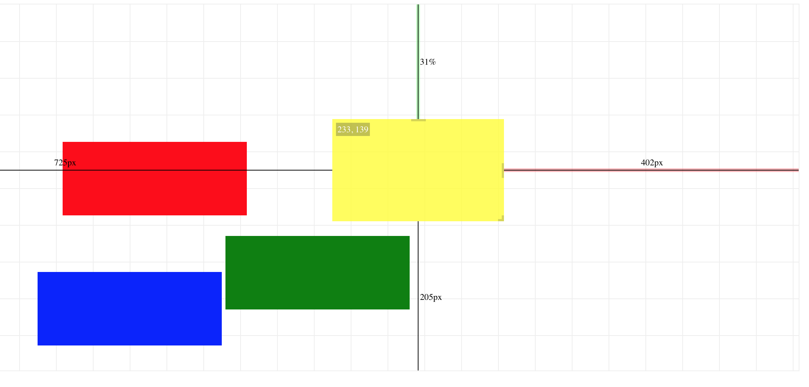

# REACT ABSOLUTE LAYOUT



Attempt to position application elements on the fly. Absolute layout component should store new positions in the local storage. Purpose: 
* getting rid layout stuff from the code (css and javascript)
* visual positioning
* ability to anchor elements with pixel or percentage distance

```typescript
class App extends React.Component<{}, {}> {
	render() {			
        const initialLayout = "EwDgDAggzAbGByBWMJ7ACwQNToQRmAQyLAS1HznnXDV3iymAAVgZF4oB2ZqdDrEA";
		return <div style={{position: 'absolute', right: 50, left: 30}}>
            <AbsoluteLayout height={500} snapToGrid={false} editing={true} name="test" initialLayout={initialLayout}>
				<div style={{backgroundColor: 'red'}}/>
				<div style={{backgroundColor: 'green'}}/>
				<div style={{backgroundColor: 'yellow'}}/>
				<div style={{backgroundColor: 'blue'}}>
					<input type="text"/>
				</div>
			</AbsoluteLayout>
		</div>
	}
}
```
